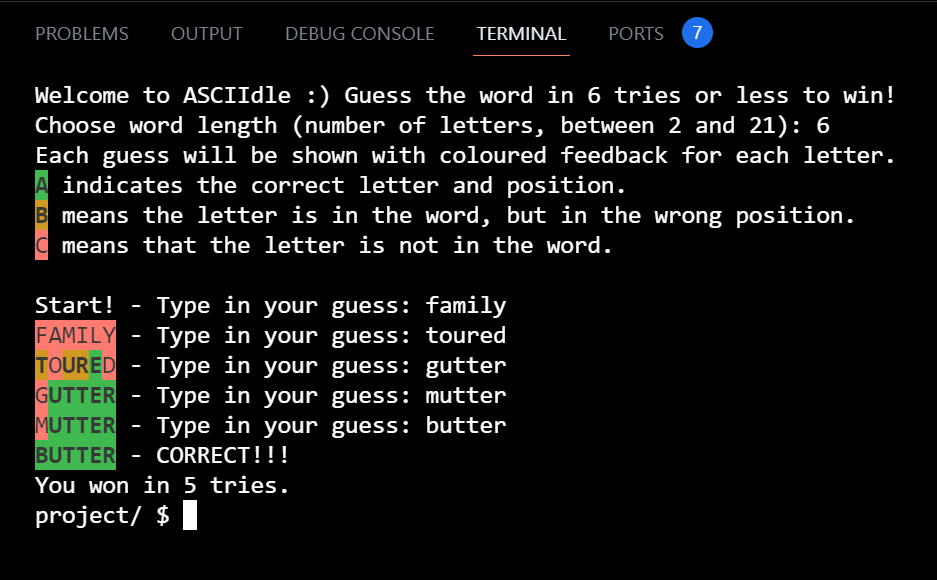

# ASCIIdle

#### Video Demo:  <https://youtu.be/5DgEFAJnfBQ>

#### Description
ASCIIdle is a word puzzle game which runs in the Python terminal.
The user selects how long the solution word should be (number of characters) and then gets 6 chances to guess the word correctly.
Coloured feedback is given for each letter in the user's guess.

#### Background
Written by Nathan Chapman for the final project for Harvard CS50’s Introduction to Programming with Python - 2023

#### Sample game screenshot

#### Installation
No installation needed.
The script project.py runs in any Python terminal, using the command python project.py
The text file words.txt must be in the same folder as project.py
Only the builtin Python modules **random** and **os** are used.

#### How it was implemented
The code is divided into a main block and three other functions.
MAIN gives the user instructions on how to play, and handles the user's responses in choosing word length.
Answers not between 2-21 letters (inclusive) are rejected.
get_answer() is then called to read the words.txt file and randomly select a word as the solution.
A for loop in main() gives the user 6 attempts to guess the word correctly.
get_guess() handles the user's responses, verifies that word length is correct and that the word exists in the word list.
check_guess() is then called, to iterate through each letter in the guess word and generate colour-coded feedback for each letter.
If the user guesses correctly, there is a "you win" message and the number of attempts is printed.
If the guess is not correct after six attempts, a "you lose" message is printed and the game ends.

## Credits
### The word list (words.txt)
was sourced from the github page for Allen Downey's book Think Python (2nd ed.)
https://github.com/AllenDowney/ThinkPython2/blob/master/code/words.txt
It is one of the word lists collected and contributed to the public domain by Grady Ward as part of the Moby lexicon
project (see http://wikipedia.org/wiki/Moby_Project). It is a list of 113,809 official
crosswords; that is, words that are considered valid in crossword puzzles and other word
games.

### Background colour codes
Codes provided coloured text feedback to the user on each letter in their guess. Codes were sourced from
https://www.lihaoyi.com/post/BuildyourownCommandLinewithANSIescapecodes.html#background-colors
